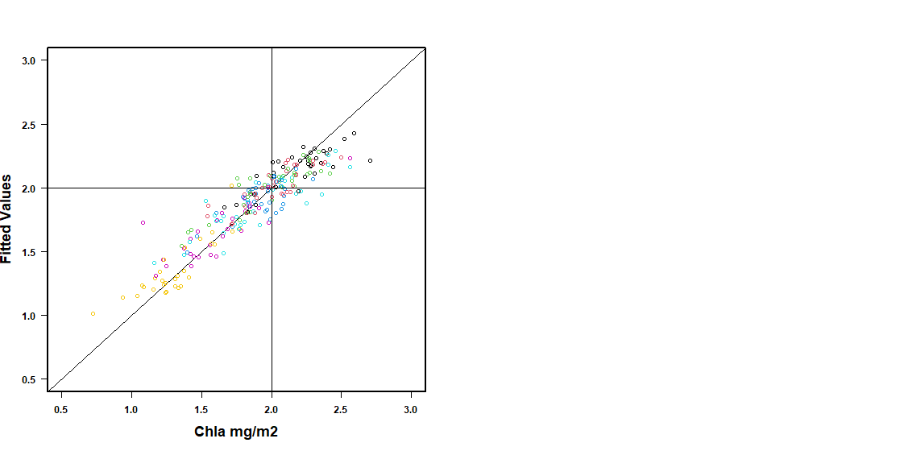
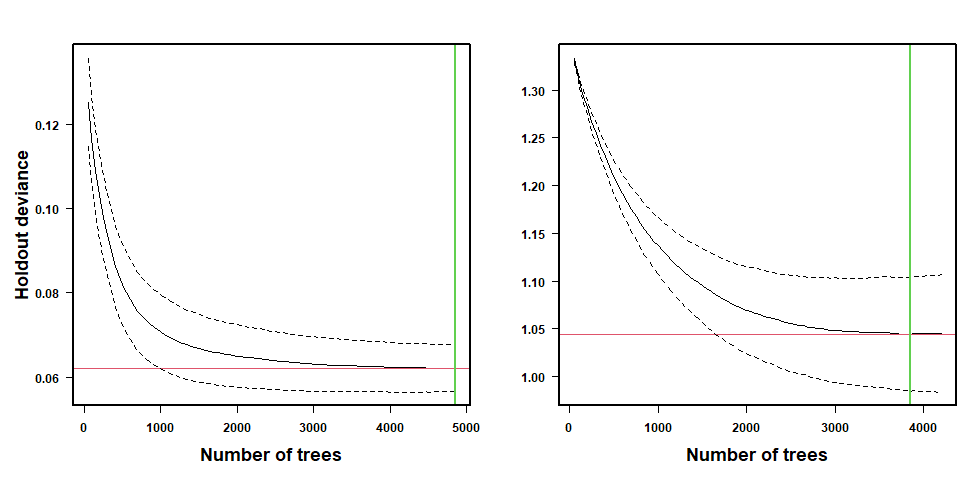
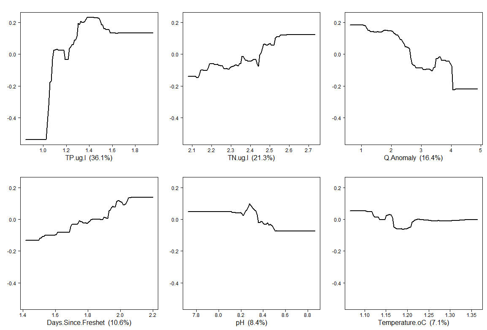
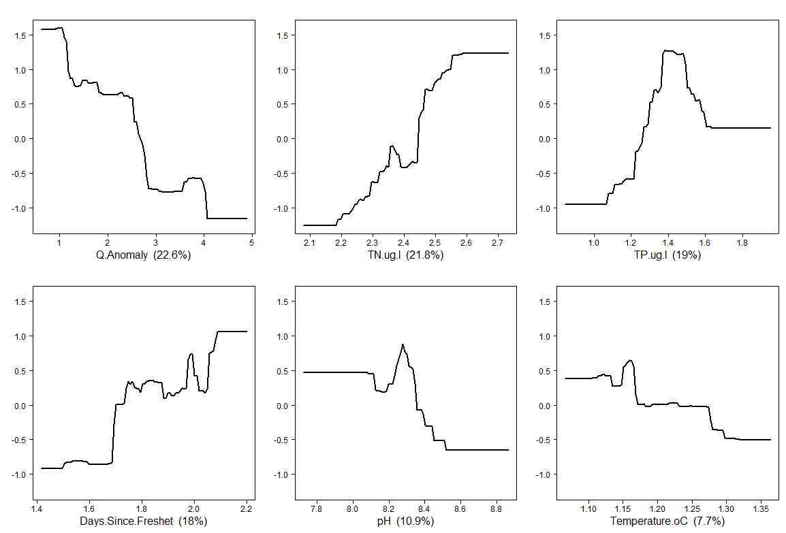
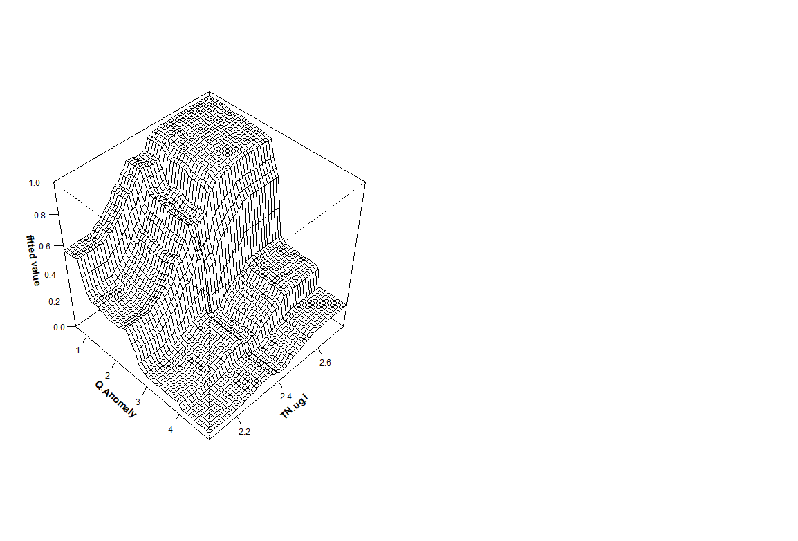

## Tentative title: 
“Forecasting algal blooms in a montane river under multiple stressors: A boosted regression tree approach.”

## Background

Algal blooms are everywhere and they are bad. Boooo!

Historic of blooms at the UCFR

Historical changes to Nut inputs. Future directions? (Claire). Historical monitoring.

Potential changes due to climate change. Freshet has been shown to influence max growth. Temperature has been shown to influence Cladophora metabolism. Timing of freshet, temperature 
and nutrient availability may have an interplay with secondary cyanobacterial blooms. 

Nonlinear relationships and thresholds are not easily captured by traditional modelling methods, hence Boosted Regression Trees.

One of the strengths of BRTs is the ease to generate predictive models.

## Objectives

Based on the historical datasets, determine the factors predicting algal blooms in the UCFR.

* Given that future nutrient mitigations are necessary:
    + Estimate how previous nutrient reductions may have influenced the pervasiveness of algal blooms in the UCFR. (Claire?)
    + Using climatic forecasts, estimate how algal blooms might respond to a warming climate under different nutrient scenarios.
       

## Methods

### Historical Datasets:

VNRP data

USGS gauge data

Statistical analyses:

### Prior to analyses:

How much to include? Glms prior to variable selection. 

### Variable Selection 

Groups:

Temporal selection of nutrient datasets. 

Total Nitrogen

Total Phosphorous

Phischem variables from VNRP dataset (Temp, pH).

Temperature

pH

Variables derived from hydrograph.  

Q anomaly:

Days since freshet:

## Results

### General patterns of main variables by site. Table. 

Chlorophyll by site (Log)

```{r, echo=FALSE, fig.cap="A caption", out.width = '100%', fig.align="center"}

```


Variance inflation test. 

```{r print.table, echo=FALSE, message=FALSE, warning=FALSE}
knitr::kable(read.csv("Manuscript_files/TABLES/test1.csv"), "simple")
```

### Predicted vs observed. How to report binomial?

```{r, echo=FALSE, fig.cap="A caption", out.width = '100%'}

```


### Holdout deviance number of trees: How to report?

```{r, echo=FALSE, fig.cap="A caption", out.width = '100%'}

```


### Partial dependency plots. Importance of variables.


```{r, echo=FALSE, fig.cap="A caption", out.width = '100%'}

```


```{r, echo=FALSE, fig.cap="A caption", out.width = '100%'}

```

### Fitted Values. Appendix?


### Interaction plots?

```{r, echo=FALSE, fig.cap="A caption", out.width = '100%'}

```

## Discussion

Performance of boosted regression trees.

Main variables that explained peak biomass.

Implications of future scenarios...

